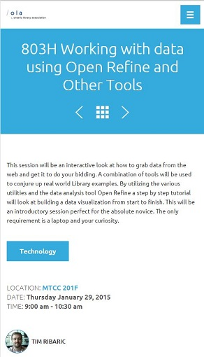

# OLA 2015 Presentation Material #

This is the presentation material used for the OLA SuperConference 2015 session:

## 803H Working with data using Open Refine and Other Tools ##

_Abstract_: This session will be an interactive look at how to grab data from the web and get it to do your bidding. A combination of tools will be used to conjure up real world Library examples. By utilizing the various utilities and the data analysis tool Open Refine a step by step tutorial will look at building a data visualization from start to finish. This will be an introductory session perfect for the absolute novice. The only requirement is a laptop and your curiosity.

Repo has the lesson plans and the slides I used.

Conference Hashtag: [\#OLASC15](https://twitter.com/search?q=%23olasc15)

- Lesson 1 - Me running on a treadmill
- Lesson 2 - Looking at Census data
- Lesson 3 - Google Refine Expression Language
- Lesson 4 - EZproxy Log Files
- Lesson 5 - Tweets
- Lesson 6 - visualizations
- Lesson 7 - Bonus round: Conference Attendees

Doesn't make sense? Please let me know: [@elibtronic](https://twitter.com/elibtronic)

