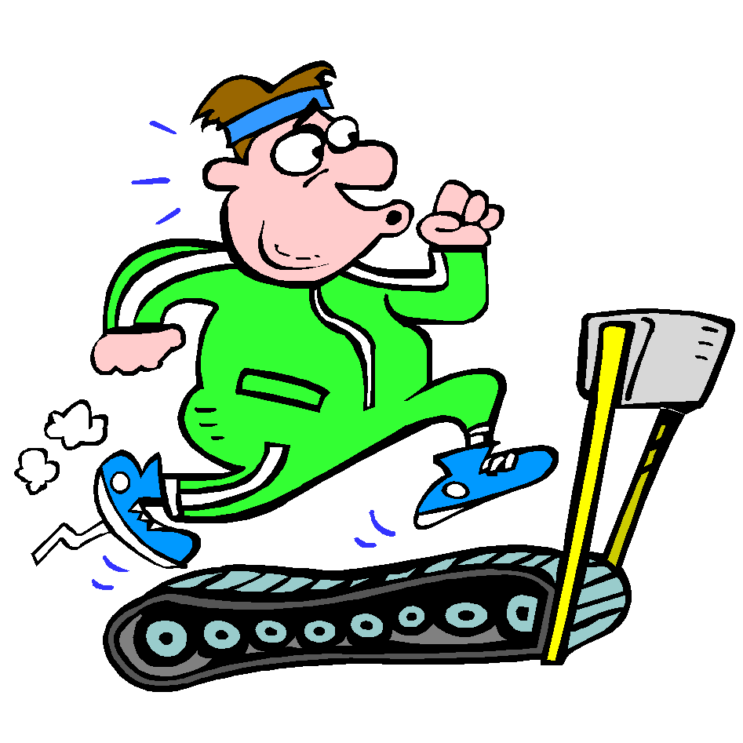

# Lesson 1#

## Tim&rsquo;s miserable treadmill performance ##

Last year I had this great idea that I would run on the treadmill to "get healthy". I also resolved to keep track of my progress on a spreadsheet.  Let&rsquo;s see how I did:

### Step 1 ###

Download the following:
[combined_treadmill.xlsx](combined_treadmill.xlsx)

If you have Excel or similar on your computer take a moment to look at the data. Yeah things fall apart in the middle of the year.

### Step 2 ###

We&rsquo;ll all walk through a few steps together:

  - Loading the file into Refine
  - General Navigation of the interface
  - Moving Columns
  - Looking at Numeric Facets

### Step 3 ###

Some simple questions:

  - What was the fastest I ran during the year?  How many days did I actually run at that speed?
  - Can you give me a rough estimate of how much time I spend on the treadmill in 2014?
  - What is happening in the Average Speed KM/h column? (Can we clean that up?)
  - Can you find any other interesting bits of data
