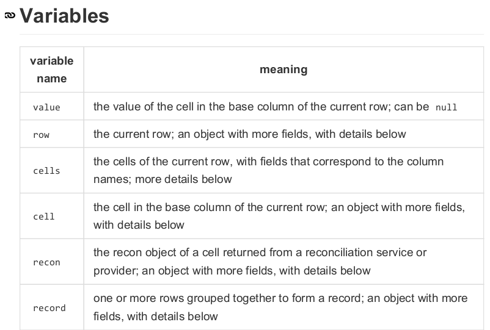
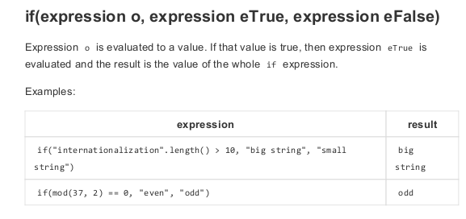
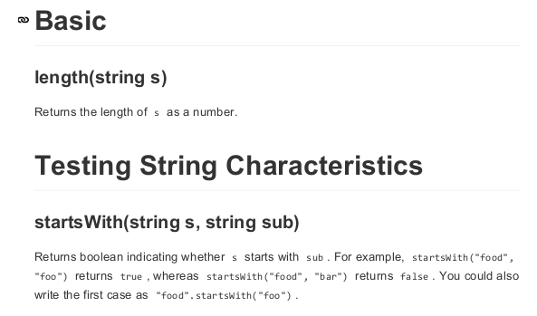
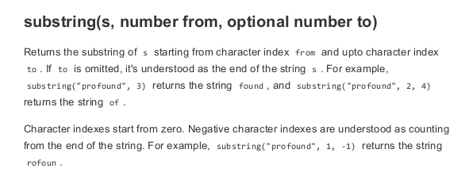

#Lesson 3#

## Google Regular Expression Evaluation Language ##

Who here knows what a regular expression is?

###Step 1###

Download this [PDF](GREL_Ref.pdf)

Originally found [here](https://github.com/OpenRefine/OpenRefine/wiki/Google-refine-expression-language)

###Step 2###

We will have a look at some basic stuff you can do with GREL. Think of them as the same features/formulas that Excel uses.

#### Variables ####

#### Basic Variable Operations ####

#### Control Statements ####

#### String Functions ####

###Step 3###

Let us go back to the [original](short_issns.csv) example we looked at to start off everything: *How can we make a GREL statement that will*:
  - add leading zeros if the ISSN was truncated to 6 characters long
  - add a hyphen into an 8 character ISSN?

_hint_ Edit Cells -> Transform

###Step 4###

GREL will manipulate the data in many different ways:
  - math functions (such as min, max)
  - compare dates
  - Parse HTML
