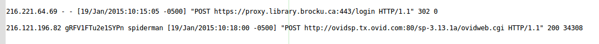

#Lesson 4#

## EZ proxy Log Files ##

The great thing about OpenRefine is that it can understand a wide variety of different types of input files

In this lesson we are going to look a (purposefully obscured) snapshot of an ezproxy log file

### Step 1 ###

Download this [text](./clf_mod.txt) file and have a look at it in your text editor.

_Please note_: Sorry, but I have reservation posted a log file even if it is anoymized. If you have EZproxy running local you should be able to grab a logfile and do the lesson. So that link above won't work.

we will need to understand before we get into the lesson is what an IP address looks like. Basically it looks like:

The number dot notation essentially creates your unique address on the web so that web content can be delivered right to you.
It is also handy because most IP address have been tied to physical locations.
Big institutions often have a _block_ of IP addresses that follow a larger pattern

EZproxy logs everything into a structure called CLF (_Common Log Format_) and this is standard seen in many different web applications.
Apache for example.
Here is a capture of two lines from that file.

### Step 2 ###

Load the file into Refine and split it into columns based on spaces

### Step 3 ###

- Based on Column 2 how many individual sessions were there
- Our pretend campus is located at IP address 439.62.\*.\* how many requests came from that IP address Range?
- By mangling the last column can you create a list of traffic that was just to _www.tanfonline.com_ and _scholar.google.com_ (Hint, excesive use of split is required). How many users was this? Can you see any other interesting info?
