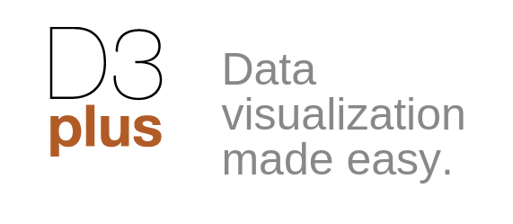
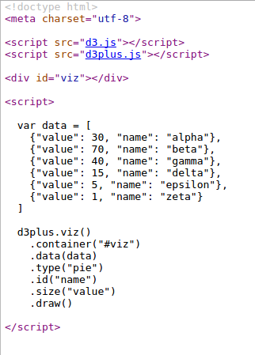

# Lesson 5 #

## Visuals!1##

### Step 1 ###

We will be working with a visualization package called _D3 Plus_, which is a simpler version of the more D3 platform.
This works by using JavaScript and HTML to generate visualizations.
The visualizations will use exported data from OpenRefine in a format called JSON.
JSON is pretty universal data format that hopefully you have seen before.

Download the [Zip](d3files.zip) file with the JS files.

Create a new folder somewhere and extract all the files there.

You should see 4 files

### Step 2 ###

- [pie.html](pie.html) - we are going to make a pie graph showing some data from our EZproxy log
- [bar.html](bar.html) - We are going to draw a bar chart from our farm data

To do this let us look at the structure of the HTML files:

### Step 3 ###

- Let's export our data from OpenRefine to do this
